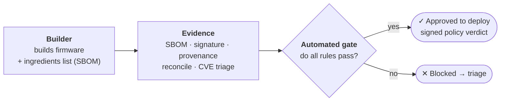
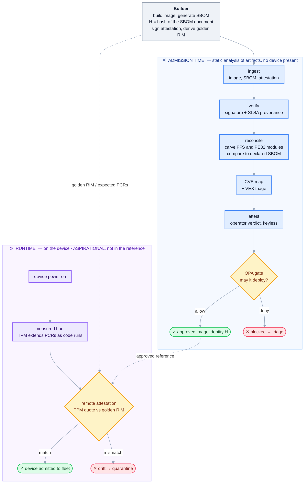
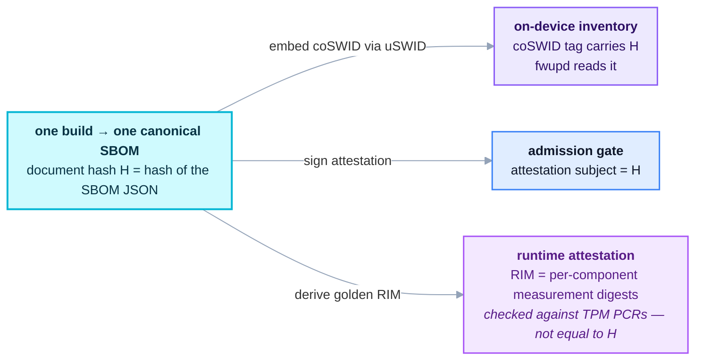

# A firmware SBOM: generate it at build, then verify it at deploy — a design for discussion

> **Status: a proposal to open a conversation, not a finished spec or a mandate.** This write-up sketches a
> shape that seems to work, backed by a running reference implementation, and asks the community whether it's
> the right shape and where it should live. Nothing here is claimed as the only way, and the honest
> limitations are called out throughout. Feedback very welcome.
>
> For how this maps to existing security frameworks (SLSA L1→L3, CRA/BSI/CISA SBOM fields, TCG RIM / RATS,
> and the normalization to in-toto/VSA vocabulary), see the companion [`FRAMEWORKS.md`](./FRAMEWORKS.md).

> **In plain terms.** The design has three moves. First, at build time, produce a signed **ingredients list**
> (an SBOM) of every module inside the firmware. Second, when someone wants to deploy that firmware,
> **independently verify** the shipped image actually matches the list — not just that the right module names
> are present, but that the bytes are what was promised. Third, feed every check into a set of **automated
> rules** (the gate) that either approves the release or blocks it, and sign the verdict so anyone downstream
> can re-check it. One distinction the design leans on: **admission-time** checks look at files *at rest*
> before anything ships, while **runtime** checks (aspirational here) later confirm the device actually booted
> what was approved. New here? Start with [`PRIMER.md`](PRIMER.md).

At a glance — who produces what, and how it reaches a signed yes/no:

> **The signed verdict is a standard SLSA VSA, extended.** The output is a standard SLSA **Verification Summary
> Attestation** (`predicateType` `https://slsa.dev/verification_summary/v1`), subject = the firmware digest `D`,
> carrying the standard summary fields (`verificationResult`, `verifiedLevels`). Because this gate verifies many
> frameworks (not just SLSA), the rich detail rides as predicate **extensions** — `verifierReports[]` (31
> always-emitted per-rule observations, 32 on a clean demo, each framework-tagged) plus **OSCAL-shaped
> `controlAssessments[]`** — 46 per-control findings
> (`satisfied` / `not-satisfied` / `missing-evidence`) across eight frameworks. in-toto/SLSA predicates are
> explicitly extensible, so a stock SLSA-VSA consumer reads the summary and ignores the rest, while our CLI +
> initiative layer read the detail. The RATS framing still holds (the gate is the *Verifier*, the deploy step is
> the *Relying Party*). See E6 in [`FRAMEWORKS.md`](FRAMEWORKS.md).

**Terms used below:** *SBOM* software bill of materials; *CycloneDX/SPDX* SBOM formats; *coSWID / uSWID*
Concise SWID tags and the tool that writes/embeds them (fwupd reads them on-device); *SLSA* supply-chain
provenance framework; *in-toto / DSSE* signed-attestation format; *keyless signing* sigstore signing with a
short-lived certificate bound to an OIDC workload identity (no long-lived private key); *VEX* Vulnerability
Exploitability eXchange (per-CVE "affected / not affected" triage); *OPA* Open Policy Agent (the Rego policy
engine); *FV / FFS / PE32* edk2 Firmware Volume, its Firmware File System entries, and the PE image inside;
*TPM / PCR* the measurement chip and its Platform Configuration Registers; *RIM* Reference Integrity Manifest
(the expected measurement values a device's PCRs are checked against); *IBV* Independent BIOS Vendor.

## Why

Firmware SBOMs are a recognized, still-unfilled need — the UEFI Forum published a firmware-SBOM proposal, and
edk2 has an open, unassigned tracking issue ([#10507]). Two pieces are missing, and they're different kinds of
thing:

1. **A generator** — something that produces a complete, accurate SBOM *from the build itself*. A static
   CycloneDX template was seeded across ~20 upstreams (incl. edk2, [#6455]) but the edk2 one auto-closed;
   nobody built the generator the template gestured at.
2. **A verifier** — the check a *consumer* of firmware needs: "does this SBOM actually describe these bytes?"
   Existing work reads an SBOM a *cooperating builder embedded*; it can't cover firmware with no embedded SBOM,
   and it can't *verify* one against the actual image.

These belong to different actors, which is the crux of the design.

## Who does what

**edk2 is a source project** — it ships source and stable tags, never a signed firmware binary. So it can
provide the *generator* (tooling), but it does not build firmware and does not verify anyone's binary. The
firmware **builder** (an IBV/OEM, a distro building OVMF, or an operator self-building) produces the image
and, ideally, the SBOM. The **operator** — the fleet/consumer — ingests someone else's firmware and has to
decide whether to trust it. Verification lives there.

```mermaid
%%{init: {"theme":"base","themeVariables":{"fontFamily":"ui-sans-serif, system-ui, -apple-system, sans-serif","fontSize":"14px","lineColor":"#94a3b8","edgeLabelBackground":"#ffffff"},"flowchart":{"curve":"basis","htmlLabels":true,"nodeSpacing":55,"rankSpacing":70,"padding":10}}}%%
flowchart LR
  E["<b>edk2 upstream</b><br/>provides the SBOM generator<br/><i>build-time -Y SBOM</i>"]
  B["<b>Builder</b> — IBV, OEM, distro, or self<br/>builds firmware and SBOM<br/>embeds coSWID"]
  O["<b>Operator</b> — fleet consumer<br/>verify, reconcile, gate"]
  D(["Devices"])
  E -->|tooling| B
  B -->|image + SBOM + attestation| O
  O -->|deploy approved image| D
  classDef upstream fill:#e0edff,stroke:#3b82f6,stroke-width:1.5px,color:#0f172a;
  classDef builder fill:#eef2f7,stroke:#64748b,stroke-width:1.5px,color:#0f172a;
  classDef operator fill:#ede9fe,stroke:#8b5cf6,stroke-width:1.5px,color:#2e1065;
  classDef device fill:#dcfce7,stroke:#22c55e,stroke-width:1.5px,color:#14532d;
  class E upstream;
  class B builder;
  class O operator;
  class D device;
```

**What we'd suggest contributing upstream is only the generator** (plus this write-up). The verification/gate
is an *operator-side reference pattern* others copy — deliberately **not** something edk2 hosts in its own CI
(edk2 doesn't sign firmware, so a signing/gate workflow there would be dead infrastructure).

## The two parts

### Part 1 — the generator (the upstream ask)

edk2's build already emits machine-readable component data: `build … -Y COMPILE_INFO` writes
`CompileInfo/module_report.json` (authoritative built-module set, resolved library instances, source `.inf`,
package deps), and `<FvName>.Fv.txt` gives FV placement. A generator is a **post-build consumer** of that
data — no build-system surgery, no binary parsing, no new heavy dependency (CycloneDX is JSON). It answers
#10507 directly and is the automated generator #6455 lacked. The natural upstream form is a native
`-Y SBOM` report type in `BuildReport.py`, reusing the same data.

*(Implemented as a native `-Y SBOM` report type — [edk2 PR #6]. A full OvmfPkgX64 DEBUG/GCC build produces a
311-component CycloneDX 1.6 SBOM: one component per built module and resolved library instance, a
module→library `dependsOn` graph (122 edges), per-component `edk2:moduleType`/`edk2:arch`/`edk2:isLibrary`
properties, and a workspace-relative `externalReference` to each module `.inf`. A generated example is
committed in the PR for direct review. Per-component binary digests, third-party submodule versions, and FV
placement are natural next increments, not yet emitted — see the reconcile note below on why digests matter.)*

### Part 2 — the operator verification + gate (a reference pattern)

The key idea readers most often miss: the lifecycle runs on **two different clocks**, and the OPA gate is the
boundary between them.

- **Admission time** — static analysis of *artifacts at rest* (the image file, its SBOM, its attestation).
  No device is involved. Everything from ingest through the gate lives here, and the gate's output is a
  decision about an **image identity**: "the firmware whose SBOM hashes to `H` is authentic, accurately
  described, and CVE-triaged → approved to deploy."
- **Runtime** — later, on the actual device: it boots, the TPM measures the code as it executes, and a
  *separate* step checks that what booted matches what the gate approved. This is where "measured boot"
  lives — **not** as a pipeline stage the operator's CI runs.

The novel piece is **reconcile**. Three *different* questions, three mechanisms, in order — this is the part
most easily conflated:

| Question | Mechanism |
|---|---|
| Is it authentic, built where it claims? | **signature + SLSA provenance** verification (cosign, keyless identity). Note provenance is itself a *signed claim* about origin — it attests where/how, not that the SBOM is accurate. |
| Does the SBOM describe *these bytes*? | **reconcile** — carve the image to its FFS/PE32 modules, compare to the declared set |
| Given all verdicts, may it deploy? | **OPA policy gate** — ANDs the facts |

A signature proves *who* signed and that it wasn't altered in transit — **not** that the SBOM is *accurate*.
Reconcile is what turns a signed *claim* into a checked *fact*.

**What reconcile can and cannot check — honestly.** Carving is real: tools parse FV → FFS (by `FILE_GUID`) →
PE32, yielding the observable **module** set. But that granularity matters:

- **Modules, not libraries.** Library instances are statically linked *into* their consuming module's PE32 —
  they have no separate byte range and are not independently carvable. So of the 311 declared components,
  reconcile directly observes the ~120 FFS **modules**; the library instances and the 122-edge dependsOn
  graph are checked only *transitively* (present inside the module that links them), not one-by-one.
- **Membership vs integrity.** Reconcile *alone* checks set-membership (is a `FILE_GUID` present/absent).
  Detecting a *modified* module needs an expected digest — and R4 supplies it: the generator now writes
  **per-module SHA-256/512 into the SBOM**, so byte-integrity compares each module's shipped bytes to the
  SBOM's *own* declared digest. The SBOM stands on its own here now (no longer "build outputs with the SBOM
  as index"). **Known bound:** a *replacement* under a declared `FILE_GUID` is caught, but a
  **shadow-duplicate** — a second FFS added under an already-declared GUID — can evade both membership
  (GUID-set keyed) and byte-integrity (one FFS extracted per GUID). Duplicate-GUID detection is the next hardening step.
- **Carving's hard edges** (where the real engineering risk sits): FV sections are LZMA/GUIDed-compressed and
  some GUIDed extractors are vendor-custom; the PE copy inside the FV is rebased/relocated/debug-stripped
  versus the build `.efi`, so bytes must be *canonicalized* before hashing or legitimate images mismatch; and
  carving surfaces **observed-but-undeclared** regions (FSP, microcode, ME, NVRAM, padding, reset vector)
  that a source SBOM never declares and that need an allowlist to avoid false "extra component" verdicts.

## Measured boot / the runtime bind (aspirational)

At **runtime**, measured boot hashes each stage of code *as it executes* and extends those hashes into the
TPM's PCRs — a fact about what physically ran on this machine. The **bind** is remote attestation: the device
emits a signed TPM **quote** of its PCRs, and a verifier compares it against a **golden RIM** (the expected
measurement values) derived from the gate-approved image. Match → the fleet is provably running what passed
policy; mismatch → something was flashed out-of-band that never went through the gate (drift or tampering).

This is the runtime continuation of the admission-time verdict — it carries "these bytes are approved"
forward onto real hardware. **It is aspirational in this design, not implemented in the reference:** it needs
a real TPM + attestation verifier, and generating a correct golden RIM / expected-PCR set for real firmware is
genuinely hard (PCR values depend on SEC/PEI/microcode and event-log ordering; predicting them even for OVMF
is nontrivial). It is shown in the lifecycle for completeness and marked as direction, not a shipped step.

## Deploy-time reconcile (CHIPSEC-fed, on-device — implemented, needs a device/image)

Between the admission-time file gate and the aspirational runtime bind sits a step we can do **today**
with an image or a live SPI dump: **deploy-time reconcile** (`producers/chipsec/deploy-reconcile.py`,
Track A). It extends the same signed, build-born SBOM baseline from "at rest" (the `.fd` the CI gate
admitted) to "on silicon" (what is actually flashed), catching post-admission / flash-time drift the
at-rest gate cannot see.

*See also:* the collection-point rationale in [ADR 0001](docs/adr/0001-chipsec-is-a-deploy-time-collection-point.md),
the SP 800-193 §4.3.1 mapping in [FRAMEWORKS.md](FRAMEWORKS.md#nist-sp-800-193-platform-firmware-resiliency--4-subsection-numbers-verified-against-the-primary-pdf),
and the Track A task map in [planning/CHIPSEC-INTEGRATION.md](planning/CHIPSEC-INTEGRATION.md); run it with `make deploy-reconcile` (see [`producers/chipsec/README.md`](producers/chipsec/README.md)).

The mechanism reuses the proven byte-integrity primitive through a **second, independent carver**:
CHIPSEC `uefi decode` extracts each module's PE bytes from the deployed image, our normalizer
(`canon_unrebase`, unchanged) reproduces the base-0 hash, and the result is reconciled **GUID-bound and
bidirectionally** against the SBOM — a same-GUID byte swap → `MISMATCH`, a declared module CHIPSEC can't
find → `MISSING`, a CHIPSEC module absent from the SBOM → `UNEXPECTED`. The module **type** is read from
CHIPSEC's FV filetype directory using the *immediate* parent (the nested-FV trap), never from the SBOM/
coSWID, preserving byte-integrity's typeless-coSWID hardening. Modules keyed by **FILE_GUID** because
names collide (two `CpuMpPei`, two `CpuDxe` with distinct GUIDs). On the OVMF reference this reconciles
**122/122** (111 direct + 11 XIP un-rebase); cross-carver agreement with the FMMT path is itself a
robustness result. Collection is **magic-based** off CHIPSEC's authoritative `.UEFI.json` (a module
is found by its `MZ`/`VZ` magic wherever it nests — robust under compressed / GUID-defined / nested-FV
sections), with a magic-based dir walk as fallback.

**Hardened coverage + skip semantics (as of the 2026-08 security hardening).** A declared module that
comes back as a TE (`VZ`) section, a non-PE blob, unextractable, or an extraction error is **UNVERIFIABLE
DRIFT, not a benign skip** — a same-GUID PE→TE swap lands here. So *clean* now requires **full coverage of
the declared set**: `matched == declared`, and `declared == sbom.integrity.hashed` (parity with
byte-integrity's `checked == hashed`) — a 1-of-N reconcile no longer passes. Every unverifiable declared
module must be a **reviewed exemption** (`data.deploy_reconcile_exempt`, default empty) or the gate
**DENYs and names it**. (The producer verdict is unconditionally strict; the exemption allowlist is a
rego-side policy decision, mirroring byte-integrity.)

In the gate it is the **conditional** `deploy-time-reconcile` verifier report (SP 800-193 §4.3.1, the
deploy-time/on-device detection leg): **absent** on the offline demo (no device, so §4.3.1 stays
advisory-MISSING and `allow` is unaffected), **gating when present** (a confirmed on-device drift DENYs,
byte-integrity-like), and graded `verified` because it is re-derived from real extracted bytes. A
**present** verdict must be **D-anchored** — a loose `DEPLOY_RECONCILE_JSON` must self-anchor
(`image_digest == D`, else it fails closed to advisory-absent), and under `REQUIRE_SIGNED_EVIDENCE=1` a
present loose verdict with no signed `DEPLOY_RECONCILE_BUNDLE` **aborts** (parity with byte-integrity's
signed-evidence enforcement). It is **deploy-time, not runtime**: it needs a device or image and is CHIPSEC
reading flash — not the boot-time Root of Trust for Detection below. Live-silicon SPI readback on real
hardware is the next step (roadmap A6); the runtime measured-boot bind remains aspirational.

> **Namespace note (stable identifiers, deliberately not renamed).** The signed `predicateType` values
> across this repo — `https://firmware-sbom-supplychain/{reconcile,byte-integrity,binary-hardening,`
> `chipsec-posture,deploy-reconcile}/v1` — and the rego rule-id namespace (`firmware-sbom-supplychain/`
> `<name>@v1`) keep the original `firmware-sbom-supplychain` token even though the project is now
> **uefi-supply-chain**. These are **stable identifiers baked into already-signed evidence**: renaming
> them would break verification of existing attestations and change the signed VSA's rule ids. The token
> is a frozen namespace, not the current project name — intentional, not a stale leftover.

### CHIPSEC-compatible `efilist.json` interop (A7)

From the *same* extracted module set, the producer can emit a CHIPSEC-`scan_image`-compatible
`efilist.json` (`--emit-efilist <path>`), so our tool and CHIPSEC cross-check each other. It is keyed by
the module's **as-found** sha256 (== CHIPSEC's `EFI_MODULE.SHA256`), value `{sha1, guid, name, type}` in
scan_image's exact field order and serialization — byte-schema-identical to CHIPSEC's own output, so
`chipsec_main -i -n -m tools.uefi.scan_image -a check,<file>,<image>` consumes it unchanged. On the OVMF
reference our decode-tree carve and CHIPSEC's independent `scan_image -a generate` model carve produce the
**same 122 entries with identical `{sha1, guid, name, type}`** — a second cross-carver agreement result,
and a mechanical guard that our extraction has not silently drifted from CHIPSEC's. `--emit-efilist-annotated`
writes a variant with an additive `sha256_norm` value field in the form CHIPSEC's `scan_image ... ,norm`
writes on the fork branch that implements it — `uefi-pe-rebase0.v1:sha256:<hex>` or
`uefi-te-rebase0.v1:sha256:<hex>`, left out where the [profile](docs/normalized-module-hash-profile.md)
gives no value — so the two tools' files can be compared entry by entry. CHIPSEC's `check` keys on the
sha256 and ignores it, so the annotated file stays check-consumable. This is a
producer **output** only — no gate control or count depends on it. (`tests/test_efilist_interop.py` asserts
the schema hermetically and the full cross-tool agreement when pefile + a decode tree + `chipsec_main` are
reachable, else SKIPs loudly.)

## One build, three linked artifacts (not "one hash everywhere")

A single build yields three artifacts for three consumers. Two of them reference the SBOM's **document hash
`H`**; the third does **not** — this is a distinction worth stating precisely, because it's easy to overclaim:

- **coSWID (on-device)** and the **signed attestation (gate)** both carry/point at the same `H`, so the SBOM
  the operator gated is provably the SBOM shipped on the device.
- The **measured-boot RIM** is *derived from the same build* but its values are **per-component runtime
  measurement digests** (hashes of the measured FV/PE32 events, in the TPM's algorithm and measurement order)
  that resolve against PCRs. Those are **not** `H`, and it would be wrong to say they are — the RIM is
  *linked to* the SBOM, not equal to its document hash.
- **Circularity caveat:** embedding a coSWID that carries `H` *into* the image changes the bytes the SBOM
  describes and that measured boot will hash. `H` must therefore be computed pre-embed (or over a region that
  excludes the coSWID section), or the reference is self-referential.

This is meant to *fit* the existing embedded-SBOM plan (coSWID/uSWID/fwupd), not compete with it.

## The three lenses

**Security.** What the gate defends against: a signed-but-inaccurate SBOM (reconcile catches it at module
granularity); a module swapped after SBOM generation (shows as `modified`, given per-module digests); an
artifact from an unexpected builder (provenance identity check); a known-critical CVE reaching the fleet (CVE
gate + VEX triage); and — at runtime, aspirationally — drift across the fleet (measured-boot bind). Trust
boundaries: generation + signing run inside an **isolated builder** with the builder's own **keyless OIDC
identity** (not any human key), on a protected trigger; the CI actions are **SHA-pinned** and inventoried in a
signed **build-tools SBOM** so the toolchain is evidence too. **Honest limitations:** the reconcile verdict is
now *generated* by `producers/reconcile/sbom-reconcile.py` from a real FMMT carve (membership: 123/123 modules
validated, 0 missing) and committed as the example. **Byte-integrity is now done** (R4):
`producers/reconcile/byte-integrity.py` matches each module's shipped PE32 bytes to the SBOM's declared hash —
DXE directly, XIP/PEI via un-rebase canonicalization (122 of the 123 non-library modules; the 123rd, `ResetVector`, is a raw blob covered by membership) — so a same-GUID swap is caught; only
TE-format/compressed sections remain out of scope. reconcile is module-granular (libraries verified transitively); the build-tools SBOM
lists direct tools, not transitive deps; one lane runs compliance
in report mode, not as a gate; and the measured-boot bind is aspirational. These are documented, not hidden.

**Functional.** Every gate input is derived from evidence: the signer identity is extracted from the verified
certificate; the SBOM's real digest is bound to the signed attestation subject; the reconcile verdict is
decoded from the signed payload; CVEs come from a real scan with a VEX allowlist for triaged findings. The
policy engine only *decides* — it gathers nothing. The same policy intent is expressible in cosign's native
Rego and in an independent tool, so the outcome isn't tool-locked.

**Operational.** For a fleet operator this is a normal release-then-deploy flow: the builder produces the
firmware + SBOM + provenance; the operator ingests, verifies, reconciles, CVE-triages (a real VEX loop — a
raw scanner over coarse firmware CPEs over-reports, so triage is required, not optional), gates, and only
then rolls out. A blocked deploy is a normal, expected event that routes to triage, not a failure.

## Relationship to existing work (not a new integration point)

- **coSWID / uSWID / fwupd** (embedded SBOM, on-device): complementary — see "one build, three linked
  artifacts" above. This fits the embedded-SBOM plan; it doesn't replace it.
- **SLSA / in-toto / sigstore / OPA:** used as-is. The provenance, signing, and policy are stock; the new
  pieces are the generator and reconcile.

## What we'd propose to contribute upstream (pending community interest)

- The **`-Y SBOM` generator** in-tree (or standalone first, promoted later), reusing `-Y COMPILE_INFO`.
- This **design write-up** on #10507 to get the shape reviewed.
- (Separately, operator-side and not upstream:) the reconcile verifier + the gate reference workflow, as a
  copy-me pattern.

## The concrete PRs this ties together

Three self-contained PRs stage the *generation + embed* half. Each stands alone technically; this document is
the hub that explains how they connect. They currently live on personal forks for review and have **not** been
sent upstream.

| PR | Repo | Role | Upstream status |
|---|---|---|---|
| [edk2 PR #6] — `-Y SBOM` generator | edk2 / BaseTools | **The anchor.** Build-time CycloneDX from the `-Y COMPILE_INFO` AutoGen data. Directly answers [#10507]; example lives in this repo. | fork; via #10507 |
| [uSWID PR #1] — CDX 1.4+ component types | hughsie/python-uswid | **The embed bridge.** uSWID converts CDX→coSWID and embeds it so fwupd reads it on-device; the generator's output tripped uSWID's type parser — this fixes the round-trip. | ✅ **upstreamed → [hughsie/python-uswid#98](https://github.com/hughsie/python-uswid/pull/98)** |
| [edk2 PR #1] — libspdm 3.7.0→3.8.2 | edk2 / SecurityPkg | **Supply-chain hygiene, same theme.** Refreshes a third-party component and honestly scopes its exposure — exactly the stale-pin an SBOM surfaces. | ✅ **upstreamed → [tianocore/edk2#12936](https://github.com/tianocore/edk2/pull/12936)** |
| [edk2 PR #5] — native `-Y SPDX` | edk2 / BaseTools | **Reserve.** Native SPDX emission if the format question calls for it; not bundled with the CycloneDX generator. | fork reserve (not proposed) |

The *verification* half (reconcile + attest + OPA gate + provenance) is this repo, operator-side, and is
deliberately **not** proposed upstream.

## Where this gets discussed (engagement sequence)

One concrete, working artifact per conversation — no big-bang proposal:

1. **[#10507]** — comment offering the `-Y SBOM` generator ([edk2 PR #6]) + example, using this write-up for
   the shape. *This is where the generator lands.*
2. **`devel@edk2.groups.io`** — edk2's canonical path is `git send-email` with maintainers Cc'd (Bob Feng,
   Yuwei Chen); the GitHub PR is a convenience mirror. PR #6 is already formatted for the list.
3. **Richard Hughes / fwupd + uSWID** — lead with the embed round-trip ([uSWID PR #1]; cf. fwupd [#9414]
   merged, [#10263] open), then the verification angle.
4. **UEFI Forum firmware-SBOM effort** — higher-level positioning once the concrete generator exists to
   point at.

**Reference topology.** This `DESIGN.md` is the single hub and links out to all three PRs. The upstream-bound
PRs cite only the **public anchor [#10507]** (never this personal repo), so each stays clean to upstream on its
own. Nothing here is posted upstream without explicit sign-off.

## Open questions for the community

1. Is `-Y SBOM` (a `BuildReport.py` report type) the right home for the generator, or a standalone tool?
2. CycloneDX vs SPDX as the primary format (the reference emits CycloneDX and converts to SPDX)?
3. Should the generator emit **per-component binary digests** so reconcile can check module *integrity* from
   the SBOM alone, rather than leaning on the build tree?
4. Is **reconcile** (declared-vs-observed) worth standardizing — most naturally as a new **in-toto predicate
   type**, not a VEX type (VEX encodes CVE exploitability, not composition)?
5. Does the one-build/three-artifacts model match the direction of the embedded-SBOM + measured-boot work?
6. Where should the boundary sit between "edk2 provides" and "operator does" — is the generator-only upstream
   ask the right scope?

## Non-goals / honest scope

Not a claim that firmware SBOMs are solved; not a finished spec; not a request to host a signing pipeline in
edk2. Reconcile is module-granular (libraries verified only transitively) and the reference draws expected
digests from the build tree. The measured-boot bind is aspirational, not implemented. Blob coverage is partial
(FSP/microcode/ME have no build report — the generator is exact only for what's built from source). Component
counts (e.g. 311) are for a specific OvmfPkgX64 DEBUG/GCC build and vary by platform/target. The reference
targets OVMF/edk2 for reproducibility. Defensive use only.

[#10507]: https://github.com/tianocore/edk2/issues/10507
[#6455]: https://github.com/tianocore/edk2/pull/6455
[edk2 PR #6]: https://github.com/houdini91/edk2/pull/6
[edk2 PR #1]: https://github.com/houdini91/edk2/pull/1
[uSWID PR #1]: https://github.com/houdini91/python-uswid/pull/1
[#9414]: https://github.com/fwupd/fwupd/pull/9414
[#10263]: https://github.com/fwupd/fwupd/pull/10263
